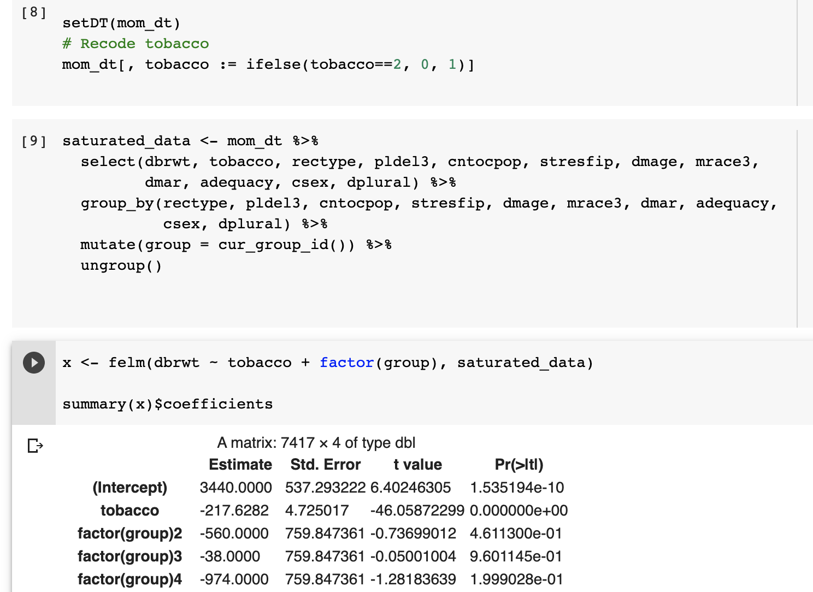

```{r setup, include=FALSE}
knitr::opts_chunk$set(echo = TRUE)

#======================
# Section 0: Set Up
#======================

# Clear workspace
rm(list = ls())

# install.packages("tidyverse")
# install.packages("MatchIt")
# install.packages("lfe")

# Load packages
library(pacman)
library(tidyverse)
library(MatchIt)
library(lfe)
library(zoo)
p_load(data.table, dplyr, foreign, readstata13, tidyr, xtable, ggplot2, binom, glmnet, stats)

# Directory 
# base_directory <- "/Users/sarajohns/Desktop/ARE213_psets/"
#base_directory <- "/Users/beckycardinali/Desktop/ARE213_psets/"
base_directory <- "/Users/yuen/Documents/GitHub/ARE213_psets/"
# base_directory <- "C:\\Users\\jacob\\Documents\\GitHub\\ARE213_psets\\"

# read data
mom_dt <- read.dta(paste0(base_directory, "ps1.dta"))

# clean data, as in pset1a

# According to the codebook, for the following medical risk factor variables, 8 corresponds to 
# "Factor not on certificate" and 9 corresponds to "Factor not classifiable": cardiac, lung, diabetes, 
#herpes, chyper, phyper, pre4000, preterm

med_risk_factors <- c('cardiac', 'lung', 'diabetes', 'herpes', 'chyper', 'phyper', 'pre4000', 'preterm')

# Below, arr.ind = TRUE returns the indices at which the row equals a certain value
for (var in med_risk_factors){
  mom_dt[var] <- replace(mom_dt[var], which(mom_dt[var] == 8, arr.ind = TRUE), NA)
  mom_dt[var] <- replace(mom_dt[var], which(mom_dt[var] == 9, arr.ind = TRUE), NA)
}

# According to the codebook, for tobacco, 9 corresponds to "Unknown or not stated"
mom_dt$tobacco <- replace(mom_dt$tobacco, which(mom_dt$tobacco == 9, arr.ind = TRUE), NA)

# According to the codebook, for cigar, 99 corresponds to "Unknown or not stated"
mom_dt$cigar <- replace(mom_dt$cigar, which(mom_dt$cigar == 99, arr.ind = TRUE), NA)

# According to the codebook, for cigar6, 6 corresponds to "Unknown or not stated"
mom_dt$cigar6 <- replace(mom_dt$cigar6, which(mom_dt$cigar6 == 6, arr.ind = TRUE), NA)

# According to the codebook, for alcohol, 9 corresponds to "Unknown or not stated"
mom_dt$alcohol <- replace(mom_dt$alcohol, which(mom_dt$alcohol == 9, arr.ind = TRUE), NA)

# According to the codebook, for drink, 99 corresponds to "Unknown or not stated"
mom_dt$drink <- replace(mom_dt$drink, which(mom_dt$drink == 99, arr.ind = TRUE), NA)

# According to the codebook, for drink5, 5 corresponds to "Unknown or not stated"
mom_dt$drink5 <- replace(mom_dt$drink5, which(mom_dt$drink5 == 5, arr.ind = TRUE), NA)

# According to the codebook, for wgain (assuming that's wtgain in codebook), 
# 99 corresponds to "Unknown or not stated"
mom_dt$wgain <- replace(mom_dt$wgain, which(mom_dt$wgain == 99, arr.ind = TRUE), NA)

mom_dt <- na.omit(mom_dt)

setDT(mom_dt)
# Recode tobacco
mom_dt[, tobacco := ifelse(tobacco==2, 0, 1)]

# We are left with 114,610 observations after cleaning, as expected from the problem set instructions
```

# Question 1

In Problem Set 1a, you used linear regression to relate infant health outcomes and maternal smoking during pregnancy. Please answer the following questions. 

(a) Under the assumption of random assignment conditional on the observables, what are the sources of misspecification bias in the estimates generated by the linear model estimated in Problem Set 1a? 

\bigskip

Even if our assumption of "selection on observables" holds, our estimates from Pset1a may be biased if $E[D|X]$ is not linear in X. That is our estimates from Pset1a impose a linear functional form on the relationship between $Y$ and $X$, or between $E[D|X]$ and $X$, causing our estimates to be biased if the true relationship is not linear. To address the potential misspecification bias, we can instead use a nonparametric method to control for X, or estimate $E[D|X]$ nonparametrically. 

\bigskip

(b) Consider a series estimator. Estimate the smoking effects using a flexible functional form for the control variables (e.g., higher order terms and interactions). What are the benefits and drawbacks to this approach? 

\bigskip

Recall from Pset1a that our list of predtermined variables, which for convenience we'll call $X$, were state of residence, age of mother, hispanic origin of mother, race of mother, educ of mother, total birth order, interval since last live birth, age of father, hispanic origin of father, month of birth, plurality, previous infant 4000 or more grams, previous preterm infant, prior birth, marital status of mother, and educ of father.

\bigskip

In our series estimator, in addition to $X$ above, to allow for a more flexible functional form we also include higher order terms of mother's and father's age and education. We also include interaction terms between mother's race and mother's age and splines for mother's age with knots at 18 and 35 (because pregnant women under the age of 18 or above the age of 35 may have higher health risks with pregnancy) and splines for mother's education with a knot at 12, for highschool completion. Specifically, we estimate the model: 

\begin{equation*}
\begin{gathered}
birthweight_i = \alpha_i + \beta smoking_i + \sum_{j = 1}^J \delta_j X_{ji} +  \gamma_1 mother\_age_i^2 + \gamma_2 mother\_age_i^3 + \gamma_3 mother\_educ_i^2 + \gamma_4 mother\_educ_i^3 + \\
\gamma_{5} father\_age_i^2 + \gamma_{6} father\_age_i^3 + \gamma_{7} father\_educ_i^2 + \gamma_{8} father\_educ_i^3 + \gamma_{9} mother\_race_iXmother\_age_i + \\
\gamma_{10} mother\_race_iXmother\_age_i^2 + \gamma_{11} I (mother\_age_i > 18) (mother\_age_i - 18)^3 + \\
\gamma_{12} I (mother\_age_i > 35) (mother\_age_i - 35)^3 + 
\gamma_{13} I (mother\_educ_i >= 12) (mother\_educ_i - 12)^3 + \epsilon_i
\end{gathered}
\end{equation*}

Where $X_j = (X_1, ... X_J)$ represents the J pre-determined variables listed above. 

```{r, include = TRUE}
# Generate higher order terms
mom_dt[,c("dmage2", "dmage3", "dfage2", "dfage3", "dmeduc2", "dmeduc3", "dfeduc2", "dfeduc3") := .(dmage^2, dmage^3, dfage^2, dfage^3, dmeduc^2, dmeduc^3, dfeduc^2, dfeduc^3)]

# Generate splines for mother's age above 18 and above 35
mom_dt[dmage >= 18 , dmage_adult := (dmage - 18)^3]
mom_dt[dmage < 18, dmage_adult := 0]
mom_dt[dmage > 35, dmage_ger := (dmage-35)^3]
mom_dt[dmage <= 35, dmage_ger := 0]
#View(mom_dt[,.(dmage, dmage_adult, dmage_ger)])

# Generate splines for mother's education highschool graduate or more
mom_dt[dmeduc >= 12, dmeduc_hs := (dmeduc-12)^3]
mom_dt[dmeduc < 12, dmeduc_hs := 0]
#View(mom_dt[,.(dmeduc, dmeduc_dropout, dmeduc_hs)])

lm1 <- lm(dbrwt ~ tobacco + factor(stresfip) + factor(mrace3) + factor(birmon) + factor(orfath) + factor(ormoth) + factor(pre4000) + factor(preterm) + factor(dmar) + dtotord + disllb + dplural + dmage + dmage2 + dmage3 + dmeduc + dmeduc2 + dmeduc3 + dfage + dfage2 + dfage3 + dfeduc + dfeduc2 + dfeduc3 + factor(mrace3)*dmage + factor(mrace3)*dmage2 + dmage_adult + dmage_ger + dmeduc_hs, mom_dt)

summary(lm1)
```

A benefit to this approach is that it is straightforward and relatively easy to implement and interpret. However, a drawback to this approach is that the choice of which covariates, higher order terms, interaction terms, and knots to include is arbitrary, so our series estimator may not accurately capture the true data generating process and we run the risk of overfitting our model or omitting an important control variable.

\bigskip

(c) Use the LASSO to determine which covariates (and higher order terms) to include in your regression from part (b). Do you end up dropping some covariates that you had thought might be necessary to include? 

\bigskip

We follow the procedure suggested by Belloni, Chernozhukov, and Hansen by first applying the LASSO to the equation in part (b). We also apply the LASSO to the model regressing treatment status on the remaining covariates: 

\begin{equation*}
\begin{gathered}
smoking_i = \pi_0 + \sum_{j = 1}^J \pi_j X_{ji} + \nu_1 mother\_age_i^2 + \nu_2 mother\_age_i^3 + \nu_3 mother\_educ_i^2 + \nu_4 mother\_educ_i^3 + \\
\nu_{5} father\_age_i^2 + \nu_{6} father\_age_i^3 + \nu_{7} father\_educ_i^2 + \nu_{8} father\_educ_i^3 + \nu_{9} mother\_race_iXmother\_age_i + \\
\nu_{10} mother\_race_iXmother\_age_i^2 + \nu_{11} I (mother\_age_i > 18) (mother\_age_i - 18)^3 + \\
\nu_{12} I (mother\_age_i > 35) (mother\_age_i - 35)^3 + 
\nu_{13} I (mother\_educ_i >= 12) (mother\_educ_i - 12)^3 + \epsilon_i
\end{gathered}
\end{equation*}
Then we regress $birthweight_i$ on $smoking_i$ and all of the covariates selected by LASSO in either equation 1 or 2 above. In each case, we cross-validate the LASSO and choose lambda such that the mean cross-validated error is within 1 standard error of the minimum. 

```{r, include = TRUE}
#First convert factor variables in dataset to factor variables
mom_dt[,stresfip := as.factor(stresfip)]
mom_dt[,cntocpop := as.factor(cntocpop)]
mom_dt[,mrace3 := as.factor(mrace3)]
mom_dt[,dmar := as.factor(dmar)]
mom_dt[,birmon := as.factor(birmon)]
mom_dt[,orfath := as.factor(orfath)]
mom_dt[,ormoth := as.factor(ormoth)]
mom_dt[,pre4000 := as.factor(pre4000)]
mom_dt[,preterm := as.factor(preterm)]

#Lasso for lm1
x1 <- model.matrix(lm1, data = mom_dt) #create X matrix
lasso_y <- cv.glmnet(x1, mom_dt$dbrwt, family = "gaussian", standardize = TRUE, intercept = TRUE, alpha = 1, type = "mse")
#plot(lasso_y)
#lasso_y$glmnet.fit
coef(lasso_y, s = "lambda.1se") #Coefficients from lasso for lambda that gets error within 1 se of the minimum

#Lasso for model of treatment status as a function of the other control variables
lm2 <- lm(tobacco ~ factor(stresfip) + factor(mrace3) + factor(birmon) + factor(orfath) + factor(ormoth) + factor(pre4000) + factor(preterm) + factor(dmar) + dtotord + disllb + dplural + dmage + dmage2 + dmage3 + dmeduc + dmeduc2 + dmeduc3 + dfage + dfage2 + dfage3 + dfeduc + dfeduc2 + dfeduc3 + factor(mrace3)*dmage + factor(mrace3)*dmage2 + dmage_adult + dmage_ger + dmeduc_hs, mom_dt) 

x2 <- model.matrix(lm2, data = mom_dt) #create X matrix
lasso_d <- cv.glmnet(x2, mom_dt$dbrwt, family = "gaussian", standardize = TRUE, intercept = TRUE, alpha = 1, type = "mse")
#plot(lasso_d)
#lasso_d$glmnet.fit
coef(lasso_d, s = "lambda.1se") #Coefficients from lasso for lambda that gets error within 1 se of the minimum

```

Based on these results, we choose to keep the following covariates: an intercept, tobacco, both levels of mother's race, a dummy for whether the mother is Puerto Rican, a dummy for whether the mother is Hispanic "other", previous infant 4000 grams or more, previous preterm infant, marital status, interval since last live birth, plurality, mother's education and the square of mother's education, father's education and the square of father's education, a spline for mother's age with a knot at 35, and the interaction term between whether the mother is black by mother's age. 

\bigskip

We drop a significant number of covariates that we had initially thought would be necessary to include, such as state of residence, birth month, hispanic origin of father, the cube of mother's and father's education, father's age and its higher order terms, mother's age and its higher order terms, and most of the spline and interaction terms. 

\bigskip

After our LASSO procedure, our final model is: 

\begin{equation*}
\begin{gathered}
birthweight_i = \alpha_i + \beta Smoking_i + \delta_1 mother\_race_i + \delta_2 mother\_hispanic_i == 2 + \delta_3 mother\_hispanic_i == 5 + \delta_4 pre4000_i + \\
\delta_5 preterm_i + \delta_6 marital\_status_i + \delta_7 last\_birth_i + \delta_8 plurality_i + \delta_9 mother\_educ_i + \delta_{10}mother\_educ_i^2 + 
\delta_{11}father\_educ_i + \\
\delta_{12}father\_educ_i^2 + \delta_{13} I (mother\_age_i > 35) (mother\_age_i - 35)^3 + \delta_{14} mother\_race_i == 3 X mother\_age_i + \epsilon_i
\end{gathered}
\end{equation*}

```{r, include = TRUE}
#Create necessary dummy and interaction terms
mom_dt[, ormoth2 := ifelse(ormoth == 2, 1, 0)]
mom_dt[,ormoth2 := as.factor(ormoth2)]
mom_dt[,ormoth5 := ifelse(ormoth == 5, 1, 0)]
mom_dt[,ormoth5 := as.factor(ormoth5)]
mom_dt[,mrace3Xdmage := ifelse(mrace3 == 3, 3*dmage, 0)]

#New model with covariates chosen from 2-stage Lasso above
lm3 <- lm(dbrwt ~ tobacco + factor(mrace3) + factor(ormoth2) + factor(ormoth5) + factor(pre4000) + factor(preterm) + factor(dmar) + disllb + dplural + dmeduc + dmeduc2 + dfeduc + dfeduc2 + dmage_ger + mrace3Xdmage, mom_dt)
summary(lm3)
```
# Question 2

Describe the propensity score approach to the problem of estimating the average causal effect of smoking when the treatment is randomly assigned conditional on the observables. How does it reduce the dimensionality problem of multivariate matching? 

\medskip

We know that if we condition on observables, we will get a consistent estimate of the ATE under the selection on observables assumption. However, if the observables are high dimensional, it might be difficult to find a comparison unit with the same values of the observables. From lecture, we know that it is sufficient instead to condition on the propensity score. Using the propensity score allows us to compare treated and control units with the same probability of being treated, controlling for any differences that are consistently related to the probability of treatment. The propensity score does not require that all values of the observables be the same and so avoids problems of multidimensionality.

\bigskip

Try a few ways to estimate the effects of maternal smoking on birthweight:

(a) First create the propensity score. For our purposes let's use a logit specification. First specify the logit using all of the "predetermined" covariates (don't include interactions). Next, include only those "predetermined" covariates that enter significantly in the first logit specification. How comparable are the propensity scores? If they are similar does this imply that we have the "correct" set of covariates in the logit specification used for our propensity score?

```{r}

# get prop score using all predetermined variables
prop_all <- glm(tobacco ~ factor(stresfip) + dmage + factor(mrace3) + dmeduc + 
                  dtotord + disllb + dfage + factor(birmon) + factor(orfath) + factor(ormoth) +
                  factor(dmar) + dfeduc + dplural + factor(pre4000) + factor(preterm),
                family=binomial(link='logit'), data = mom_dt)
mom_dt[, prop_score_all := fitted(prop_all)]

# take a look at the output to see which are significant - omitting because takes up a lot of space
# summary(prop_all)
# only need to take out state of residence. birth month has a few months that are significant so will keep

# get prop score using significant variables from previous logit
prop_sig <- glm(tobacco ~ dmage + factor(mrace3) + dmeduc + 
                  dtotord + disllb + dfage + factor(birmon) + factor(orfath) + factor(ormoth) +
                  factor(dmar) + dfeduc + dplural + factor(pre4000) + factor(preterm),
                family=binomial(link='logit'), data = mom_dt)
mom_dt[, prop_score_sig := fitted(prop_sig)]

# how different are the prop scores?
prop_score_diff <- mom_dt$prop_score_all - mom_dt$prop_score_sig
summary(prop_score_diff)
# a few outliers but not very different

```

In the first logit, we include state of residence, mother's age, mother's race, mother's hispanic origin, mother's education, birth order, interval since last birth, father's age, father's Hispanic origin, father's education, birth month, plurality, previous heavy child, and previous preterm. This is a combination of the "predetermined" variables we selected and discussed in the last problem set and the ones discussed in the problem set solutions. We find that all coefficients are significant, except for state of residence. We remove that from the next regression and the propensity scores, which are the fitted values of the logit, do not change very much. This does not guarantee we are estimating the logit with the correct set of covariates. There could be important covariates that we do not have in this dataset that we would want to use in the logit specification. The fact that our propensity scores do not change much between the two specifications just gives us confidence that state of residence was not an important regressor to include. Moving forward, we will use the propensity scores from the second specification.

\bigskip

(b) Control directly for the estimated propensity scores using a regression analysis, and estimate an average treatment effect. State clearly the assumptions under which your estimate is correct.

```{r}

# run regression with prop_score
prop_reg <- lm(dbrwt ~ tobacco + prop_score_sig, data = mom_dt)

```

Controlling directly for the propensity score, we get the ATE is `r round(prop_reg$coefficients[[2]], 2)` and is statistically significant at the 99.9\% level. The assumption under which this estimate is consistent is unconfoundedness and homogeneous treatment effects. If we instead believed that there were heterogeneous treatment effects (that varied with $X$), then this regression does not provide meaningful results.

\bigskip

(c) As discussed in class, one can use the estimated propensity scores to reweight the outcomes of non-smokers and estimate the average treatment effect. Compute an estimate of the average treatment effect and the "effect of the treatment on the treated" by appropriate reweighting of the data. 

```{r}

# create propensity weights
mom_dt[,prop_weights := ifelse(tobacco == 1, 
                          1/prop_score_sig, 
                          1/(1 - prop_score_sig))] 
# normalize the weights
mom_dt[,norm_prop_weights := ifelse(tobacco == 1, 
                               prop_weights/sum(mom_dt[tobacco == 1, prop_weights]),
                               prop_weights/sum(mom_dt[tobacco == 0, prop_weights]))] 
# estimate ATE
tau_ipw <- sum((mom_dt$tobacco*mom_dt$dbrwt)*(mom_dt$norm_prop_weights) - 
                 ((1 - mom_dt$tobacco)*mom_dt$dbrwt)*(mom_dt$norm_prop_weights))

# estimate TOT - use formula from section 
tot_y1 <- sum(mom_dt$tobacco*mom_dt$dbrwt) / sum(mom_dt$tobacco) 
tot_y0 <- sum(mom_dt$prop_score_sig * (1 - mom_dt$tobacco) * mom_dt$dbrwt / 
        (1 - mom_dt$prop_score_sig)) /
  sum(mom_dt$prop_score_sig * (1 - mom_dt$tobacco) / 
        (1 - mom_dt$prop_score_sig))

tau_tot <- tot_y1 - tot_y0
```

We have from lecture that the ATE using inverse propensity weighting is 

$$ \hat{\tau}_{ATE} = \bigg(\sum^N \frac{D_iY_i}{\hat{p}(X_i)} / \sum^N \frac{D_i}{\hat{p}(X_i)}) - (\sum^N \frac{(1-D_i)Y_i}{1-\hat{p}(X_i)} / \sum^N \frac{1-D_i}{1-\hat{p}(X_i)}\bigg) $$ 

and using this formula, we get that the ATE is `r round(tau_ipw, 2)`. We have from section that the TOT using inverse propensity weighting is 

$$ \hat{\tau}_{TOT} = \bigg(\sum^N D_iY_i / \sum^N D_i - (\sum^N \frac{\hat{p}(X_i)(1-D_i)Y_i}{1-\hat{p}(X_i)} / \sum^N \frac{\hat{p}(X_i)(1-D_i)}{1-\hat{p}(X_i)}\bigg)  $$

and using this formula, we get that the TOT is `r round(tau_tot, 2)`.

\bigskip

(d) Estimate the counterfactual densities relevant for the above part with a kernel density estimator. That is, estimate the density of birthweight (or log birthweight) if everyone smoked and again if no one smoked. Hint: Consider directly applying the Hirano, Imbens, and Ridder propensity score reweighting scheme in the context of estimating the densities of the treated and control groups (rather than the means of the treated and control groups). Stata has very useful preprogrammed commands. In addition to using the preprogrammed Stata command to compute/graph the kernel density over the entire range of birthweight, please also calculate by hand the kernel estimator at birthweight equals 3,000 grams (and provide the code you wrote that shows the calculation of the kernel estimator at this single point). Play around with a bandwidth starting with half the default Stata bandwidth. Choose the same bandwidth for all the pictures, and produce a (beautiful, production quality) figure depicting both densities.

```{r}

d0 <- density(mom_dt[tobacco==0,dbrwt], kernel="gaussian", bw="sj", 
              adjust=1, weights=mom_dt[tobacco==0,norm_prop_weights])
d1 <- density(mom_dt[tobacco==1,dbrwt], kernel="gaussian", bw="sj",
              adjust=1, weights=mom_dt[tobacco==1,norm_prop_weights])

plot(d0, col="blue", main="Counterfactual Densities", 
     xlab = "Birthweight (g)")
lines(d1, col="red")
legend(1, 0.0008, legend=c("Non-smoker", "Smoker"), 
       col=c("blue","red"), lty=1, cex=0.8)

```

In order to get the counterfactual densities, we weight the treated and control groups by the normalized inverse propensity scores, similar to our calculation above. We use the density() function with a Gaussian kernel and a bandwidth using the methods of Sheather & Jones (1991) which uses pilot estimation of derivatives. This results in a bandwidth of `r round(d0$bw, 2)` for the control and a bandwidth of `r round(d1$bw, 2)` for the treated. As we expect from our estimates of the ATE, the density of the birthweights for the treated group is shifted to the left of the control group (lower birthweights).

```{r}

d_all <- density(mom_dt$dbrwt, kernel="gaussian", bw="sj", adjust=1)
plot(d_all, col="black", main="Kernel Density, Full range of birthweights", 
     xlab = "Birthweight (g)")

# kernel estimator at 3000 g
# use bandwidth selected above: h = 49
h <- d_all$bw
ke_3000 <- 1 / (nrow(mom_dt) * h * sqrt(2*pi)) * sum(exp(-0.5 * (((3000-mom_dt$dbrwt)/h)^2 )))

```

We plot the kernel density over the entire range of birthweights, using the Gaussian kernel and selecting the bandwidth using the methods of Sheather & Jones (1991) which uses pilot estimation of derivatives. For the entire range of birthweights, this gives us a bandwidth of `r round(d_all$bw, 2)`. We then calculate the kernel estimator by hand at a weight of 3000 grams using the Gaussian kernel and this bandwidth. Our formula is 

$$ \hat{f}(x) = \frac{1}{nh} \frac{1}{\sqrt{2 \pi}} \sum\limits_i^n e^{-1/2 (\frac{x - x_i}{h})^2} $$

where $x = 3,000$ , $n=$ `r nrow(mom_dt)`, and $h=$ `r round(d_all$bw, 2)`. We get that the density at 3000g is `r round(ke_3000, 5)`, which visually corresponds to our plot of the density.

\bigskip

(e) Take one of your densities and display an estimate of the density using different bandwidths as well as the one you settled on. What happens with bigger (smaller) bandwidths?

```{r}
# plot bandwidth selected
plot(d1, col="black", main="Kernel Density, Smoker: Selected Bandwidth", 
     xlab = "Birthweight (g)")
# bw of treated group is 68.9, what if we used 49.8 like control?
d1_low <- density(mom_dt[tobacco==1,dbrwt], kernel="gaussian", bw=49.8, adjust=1, 
                  weights=mom_dt[tobacco==1,norm_prop_weights])
plot(d1_low, col="black", main="Kernel Density, Smoker: Lower Bandwidth", 
     xlab = "Birthweight (g)")
# what if we raised it?
d1_high <- density(mom_dt[tobacco==1,dbrwt], kernel="gaussian", bw=200, adjust=1, 
                   weights=mom_dt[tobacco==1,norm_prop_weights])
plot(d1_high, col="black", main="Kernel Density, Smoker: Higher Bandwidth", 
     xlab = "Birthweight (g)")
# what if we made it very low
d1_verylow <- density(mom_dt[tobacco==1,dbrwt], kernel="gaussian", bw=20, adjust=1, 
                      weights=mom_dt[tobacco==1,norm_prop_weights])
plot(d1_verylow, col="black", main="Kernel Density, Smoker: Very Low Bandwidth", 
     xlab = "Birthweight (g)")

```

We use the treated group counterfactual density and try a few different bandwidths. First, we plot our selected bandwidth, `r round(d1$bw, 2)`. Next, since the treated group is smaller than the control group, the bandwidth selected had been larger than that of the control group, so we plot the density had we used the same bandwidth as the control, ~ 49.8. Next we crank up the bandwidth to 200 and finally we drop it to 20. The higher the bandwidth, the smoother the density. At a bandwidth of 20, the density becomes a lot choppier. This is what we expect as a lower bandwidth in a Gaussian kernel gives less weight to observations further from x, making $\hat{f}(x)$ more sensitive to observations closer to x, producing less smoothing.

\bigskip

(f) What are the benefits of the weighting approach (from part c)? What are the potential drawbacks? Pay particular attention to to the issue of people with extremely high and extremely low values of the propensity score.

\medskip

The benefits of the weighting approach in part c are that we can get consistent estimates of the ATE and TOT that are also efficient. One potential drawback is that we have to first estimate the propensity score, which we are not certain we estimate correctly. Additionally, we run into problems if there is insufficient overlap in the treatment and control distributions of the covariates. This in turn would cause insufficient overlap in the propensity score itself, where there would be ranges of $p(X)$ that contain many estimated scores from the treatment group but not from the control group, or vice versa. If the propensity score $p(X_i)$ gets close to zero or one, then the weights become enormous, making our estimation in part (c) above very sensitive to outliers. Specifically, since people with extremely high propensity scores would mostly be found in the treated group and people with extremely low propensity scores would mostly be found in the control group, any observations with extremely high propensity scores found in the control group, or with extremely low propensity scores found in the treatment group, would receive an enormous weight since our weighting scheme above balances the propensity score across treated and control group. Our estimation would then be very sensitive to a few observations, or outliers. To address this concern, we can trim observations above or below certain propensity scores to improve overlap between treatment and control, as in Imbens (2007). 

\bigskip

(g) Present your findings and interpret the results on the relationship between birthweight and smoking. For the estimates in parts (b) and (c), consider which of the following conditions must hold in order for that estimate to be valid:
(A1) The treatment effect heterogeneity is linear in the propensity score.
(A2) The treatment effect heterogeneity is not linear in the propensity score.
(A3) The decision to smoke is completely randomly assigned.
(A4) Conditional on the exogenous variables the decision to smoke is randomly assigned.

\medskip

Our findings are included with the relevant sections above. All of our results are consistent with one another in finding that smoking causes lower birthweights -- as indicated by our estimates of the ATE, the TOT, and the counterfactual densities of birthweight. In part (b), we include the propensity score in a regression. In order for this estimate to be valid, we need assumptions A1 and A4 to hold (assuming we also include an interaction term between treatment status and the propensity score to allow for heterogeneous treatment effects). In part (c), we again need assumption A4 to hold. 

# Question 3
A potentially more informative way to describe how birth weight affects smoking is to estimate the "non-parametric" conditional mean of birth weight as a function of the estimated probability of smoking, separately for smokers and non-smokers on the same graph. To do so, divide the data from smokers into 100 approximately equally spaced bins based on the estimated propensity score. Do teh same for nonsmokers. Use the blocking estimator we discussed in class. Interpret your findings and relate them to the results in (2b).

# Question 4
Low birth weight births (less than 2,500 grams) are considered particularly undesirable since they comprise a large share of infant deaths. Redo question 3 using an indicator for low birth weight births as the outcome of interest. Interpret your findings.

# Question 5

Let's link matching back to regression. Consider the conditional expectation function $E[ \ birthweight \ | \ X]$, where $X$ contains the following variables: \texttt{rectype pldel3 cntocpop stresfip dmage mrace3 dmar adequacy csex dplural}. 

\bigskip

(a) Develop a regression that you are confident estimates $E[ \ birthweight \ | \ X]$ as $N \rightarrow \infty$? Why are you confident that your regression gets the CEF right?

\bigskip 

A regression of birthweight on a saturated model for the discrete regressors (i.e. a model with a separate parameter for every possible combination of values that the set of regressors can take on) will produce asymptotically consistent estimates of the CEF, assuming that as $N \rightarrow \infty$ we would add in more dummy variables for any additional new combinations of the variables in $X$ that appear in the data.

We are confident that this regression gets the CEF right because having a saturated model for discrete regressors is a sufficient condition for the CEF to be linear. Then by the Regression-CEF Theorem, as long as the CEF is linear the regression of $Y$ on $X$ estimates the CEF. Formally, if $E[y_i|x_i] = x_i\gamma$, then $\gamma = E[x_i'x_i]^{-1}E[x_i'y_i]$, which the regression coefficient will converge to.

\bigskip

To see that we can estimate a fully saturated model, note from the codebook that all of our regressors are indeed discrete: 
\begin{itemize}
\item \texttt{rectype} is record type (resident or nonresident): a discrete variable with values $\in \{1, 2\}$
\item \texttt{pldel3} is place or facility of birth: a discrete variable with values $\in \{1, 2\}$
\item \texttt{cntocpop} is population size of county of occurrence: a discrete variable with values $\in \{0, 1, 2, 3\}$
\item \texttt{stresfip} is state of residence: a discrete variable with values $\in \{0, ..., 55\}$
\item \texttt{dmage} is age of mother: a discrete variable with values $\in \{12, 13, ..., 49\}$
\item \texttt{mrace3} is race of mother: a discrete variable with values $\in \{1, 2, 3\}$
\item \texttt{dmar} is marital status of mother: a discrete variable with values $\in \{1, 2\}$
\item \texttt{adequacy} is adequacy of care index: a discrete variable with values $\in \{1, 2, 3\}$ 
\item \texttt{csex} is child sex: a discrete variable with values $\in \{1, 2\}$
\item \texttt{dplural} is plurality (single, twin, triplet, etc): a discrete variable with values $\in \{1, 2, 3, 4\}$
\end{itemize}

\bigskip

(b)*Now run the regression you propose above, but add the treatment (your binary smoking variable) as the righthand side variable of interest. Prove that if the treatment effect of smoking on birthweight is independent of the covariates in $X$, then exact matching and your regression estimate the same thing. You may assume the conditional indpendence assumption holds given the variables in $X$ listed above. 

\bigskip

We estimate the saturated model from (a) with our treatment variable (smoking during pregnancy) also on the right hand side. Specifically, we estimate $y_i = \alpha + \tau D_i + \beta g(X_i) + \epsilon_i$, where $D_i$ represents treatment status and $g(X_i)$ captures all of the parameters for every possible combination of values in our other regressors.

```{r}
# the following code came from Arthur's tip on the Slack channel

saturated_data <- mom_dt %>%
  # take a subset of the data with only the variables we are interested in
  select(dbrwt, tobacco, rectype, pldel3, cntocpop, stresfip, dmage, mrace3, 
         dmar, adequacy, csex, dplural) %>%
  # combinations of the variables in X
  group_by(rectype, pldel3, cntocpop, stresfip, dmage, mrace3, dmar, adequacy, 
           csex, dplural) %>%
  # give each group a unique id
  mutate(group = cur_group_id()) %>%
  ungroup()

# the output (from running on Google Colab) is included below
# the line below takes a long time to run, so is commented out

# felm(dbrwt ~ tobacco + factor(group), saturated_data)

```



Our model estimates an ATE of $\tau = -217.6$, that is maternal smoking is associated with a decrease of 217.6 grams in birth weight, ceteris paribus.  

\bigskip

Note that our regression estimate and an exact matching estimator produce the same result under the assumptions that the treatment effect of smoking on birthweight is independent of the covariates and that the conditional independence assumption holds given our variables in $X$. To see this, note that from Lecture Notes 2C we can define a generic matching estimator as: 

$$\hat{\tau}_M = \frac{1}{N_T}  \sum_{i \in \{D_i=1\}} [y_i -  \sum_{j \in \{D_j=0\}} w_i(j)y_j]$$

For exact matching, we match observations that have the exact same values for each covariate, that is we set the weights $w_i(j) = 1$ if $X_i = X_j$, and to 0 otherwise. Formally, we can define the weights for exacting matching as $w_i(j) = \dfrac{\textbf{1}\{X_i = X_j\}}{ \sum_{j \in \{D_j=0\}} \textbf{1}\{X_i = X_j\}}$, so that $\sum_j w_j(j)y_i = \bar{y}_c$ the control mean, so $\hat{\tau}_M$ is just the difference in means between the treatment and control groups. 

$$\hat{\tau}_M = \frac{1}{N_T}  \sum_{i \in \{D_i=1\}} [y_i -  \sum_{j \in \{D_j=0\}} w_i(j)y_j]$$


$$= \frac{1}{N_T}  \sum_{i \in \{D_i=1\}} [y_i -  \sum_{j \in \{D_j=0\}} \dfrac{\textbf{1}\{X_i = X_j\}}{ \sum_{j \in \{D_j=0\}} \textbf{1}\{X_i = X_j\}}y_j]$$

Substituting $y_i$ with the conditional expectation of $y$ given $X_i, D_i$, gives us: 

$$= \frac{1}{N_T}  \sum_{i \in \{D_i=1\}} [E[y_i|D_i=1, g(X_i)] -  \sum_{j \in \{D_j=0\}} \dfrac{\textbf{1}\{X_i = X_j\}}{ \sum_{j \in \{D_j=0\}} \textbf{1}\{X_i = X_j\}}E[y_j|D_j=0, g(X_j)]]$$

Under the assumptions of unconfoundedness, conditional independence, and a constant treatment effect, and because our CEF is linear under a fully saturated model, we know that we can consistently estimate $[E[y_i|D_i, g(X_i)]$ with the regression $y_i = \alpha + \tau D_i + \beta g(X_i) + \epsilon_i$. Substituting into our expression above yields: 

$$= \frac{1}{N_T}  \sum_{i \in \{D_i=1\}} [(\alpha + \tau + \beta g(X_i)) -  \sum_{j \in \{D_j=0\}} \dfrac{\textbf{1}\{X_i = X_j\}}{ \sum_{j \in \{D_j=0\}} \textbf{1}\{X_i = X_j\}}(\alpha + \beta g(X_j))]$$

and since we are only interested in $X_i = X_j$ for exact matching, 

$$= \frac{1}{N_T}  \sum_{i \in \{D_i=1\}} [(\alpha + \tau + \beta g(X_i)) -  \sum_{j \in \{D_j=0|X_i = X_j\}} \dfrac{1}{ \sum_{j \in \{D_j=0\}} \textbf{1}\{X_i = X_j\}}(\alpha + \beta g(X_j))]$$

$$= \frac{1}{N_T}  \sum_{i \in \{D_i=1\}} [(\alpha + \tau + \beta g(X_i)) -  \dfrac{ \sum_{j \in \{D_j=0|X_i = X_j\}} 1}{ \sum_{j \in \{D_j=0|X_i = X_j\}} \textbf{1}\{X_i = X_j\}}(\alpha + \beta g(X_j))]$$

$$= \frac{1}{N_T}  \sum_{i \in \{D_i=1\}} [(\alpha + \tau + \beta g(X_i)) -  (\alpha + \beta g(X_j))]$$

$$= \frac{1}{N_T}  \sum_{i \in \{D_i=1\}} \tau$$

$$= \frac{1}{N_T} N_T* \hat\tau$$

$$=\hat\tau$$

As we can see, under the assumption that the treatment effect of smoking on birthweight is independent of the covariates and that the conditional independence assumption holds, exact matching and our regression model both consistently estimate the ATE $\hat{\tau}$. 

\bigskip

(c)*Develop a weighted version of the exact matching estimator that estimates the same thing as the regression above (regardless of whether the treatment effect is independent of covariates). 

\bigskip

The following was discussed with and inspired by Abdou. Under the assumption that the treatment effect is independent of the covariates, a simple difference in means between the treatment and control groups (as discussed in part b above) is sufficient to consistently estimate the ATE. However, if we relax the assumption that the treatment effect is independent of the covariates, then we are essentially allowing for selection on the observables, and we need to adjust our weights accordingly. Intuitively, we want to place less weight on observations in cells where there is little overlap between treatment and control, and more weight on observations in cells with more overlap between treatment and control. 

Because we have exact matching, each treatment and control observation will belong to only one cell, where we define a cell $k$ as all observations for which $X_i = X_j$. Define $n_{ik} = |\{j: j \in k \ \& \ D_i = D_j\}| = |\{j: X_i = X_j \ \& \ D_i = D_j\}|$ as the number of observations with the same treatment status as $i$ in a given cell $k$, $D_{ik}$ being the treatment status of $i$ in cell $k$. Since we also need to account for within-cell overlap of the treatment status in our weights, we also define $\sigma_k$ as the within-cell variance of treatment status. Then we define our weights as: 

$$w_{ik} = \dfrac{n_{ik}\sigma_k N_c}{\sum_{k=1}^K \sum_{i \in (D_i = c)} n_{ik}\sigma_k} \forall c \in 0,1$$

which are normalized to sum to $N_T$ and $N_C$ for treatment and control observations respectively, where $N_T$ is the total number of treatment observations and $N_C$ is the total number of control observations in our sample. Note that this weighting scheme gives 0 weight to observations in cells with insufficient overlap in treatment status, that is cells with only treatment or only control observations. 

$$\sum_{D_i = c} w_{i} = N_c \text{ for } c \in \{0,1\}$$
Then, using the weights defined above, we can estimate the ATE as: 

$$\tau_M = \frac{1}{N_T}\sum_{D_i = 1} y_{ik} w_{ik} - \frac{1}{N_C}\sum_{D_i = 0} y_{ik}w_{ik}$$

\bigskip

(d)*Estimate the weighted matching estimator you propose. Compare it to the regression estimate from part (b). Are they similar?

```{r} 
#Generate weights
saturated_data <- as.data.table(saturated_data) #set data as a data.table
N_T <- nrow(saturated_data[tobacco == 1]) #number of treatment observations
N_C <- nrow(saturated_data[tobacco == 0]) #number of control observations

saturated_data[,n:= .N, by = .(group, tobacco)] #generate n_jk, which is the number of observations in each group with the same treatment status
saturated_data[,vark := var(tobacco), by = .(group)] #generate var_k, which is the variance of the treatment variable within each group
saturated_data[,nvark := n*vark] #generate a variable = n*vark
saturated_data[,matching_weights := ifelse(tobacco == 1, nvark*N_T/sum(saturated_data[tobacco == 1 & !is.na(nvark), nvark]), nvark*N_C/sum(saturated_data[tobacco == 0 & !is.na(nvark), nvark]))] #normalize weights so that they sum to N_T and N_C respectively

# estimate ATE
tau_M <- (1/N_T)*sum(saturated_data[tobacco == 1 & !is.na(matching_weights), matching_weights*dbrwt]) - (1/N_C)*sum(saturated_data[tobacco == 0 & !is.na(matching_weights), matching_weights*dbrwt])

# [old way of estimating ATE when weights added up to 1; we can delete the code before submission, this is just for a reference]
#saturated_data[tobacco == 1,ywT := sum(dbrwt*matching_weights), by=.(group)] #within each group, generate the sum of y_ik * w_ik for treated observations
#saturated_data[tobacco == 0,ywC := sum(dbrwt*matching_weights), by=.(group)]#within each group, generate the sum of y_ik * w_ik for control observations
#saturated_data <- saturated_data[,ywT := na.locf0(ywT, fromLast = TRUE), by = .(group)][,ywT := na.locf(ywT), by = .(group)] #fill in NAs so that each observation in each group has a ywT value
#saturated_data <- saturated_data[,ywC := na.locf0(ywC, fromLast = TRUE), by = .(group)][,ywC := na.locf(ywC), by = .(group)] #fill in NAs so that each observation in each group has a ywC value
#saturated_data_groups <- unique(saturated_data, by = "group") #create sub-table that includes 1 observation per unique group
#tau_M <- sum(saturated_data_groups[!is.na(ywT) & !is.na(ywC),ywT-ywC]) #By our formula for the ATE for our proposed weighted matching estimator
```

\bigskip

As discussed in part (c) above, we estimate weights:
$$w_{ik} = \frac{n_{ik} \sigma_{k} N_c}{\sum_{k=1}^K \sum_{i \in (D_i = c)} n_{ik} \sigma_{k}} \forall c \in {0,1}$$
And then use our weights to estimate the ATE:
$$\tau_M = \frac{1}{N_T}\sum_{D_i = 1} y_{ik} w_{ik} - \frac{1}{N_C}\sum_{D_i = 0} y_{ik}w_{ik}$$
Using this procedure, we estimate $\tau_M =$ `r round(tau_M, 2)`, which is less than what we estimated in part (b). 

(e)*Is the sample size of your regression the same as the sample size of your matching estimator, or does the regression have more observations? If the regression has more observations, why don't these extra observations influence the treatment effect estimate? 

\bigskip
The sample size of the regression and the sample size of the matching estimator are not the same. The regression has more observations. This is because for the matching estimator, if a given cell doesn't have both a control and treatment observation, then that cell is dropped because we cannot estimate the treatment effect within that cell. But the regression doesn't drop any observations, it just gives 0 weight to the observations where there is not an exact match of covariates in treatment and control, so these "extra" observations do not influence our estimate of the ATE. 

\bigskip

(f)*Compute a standard error for your matching estimator using the formula from Imbens (2015). Specifically, note that your matching estimator should have a form $\frac{1}{N_t}\sum_{d_i=1} w_i y_i - \frac{1}{N_c} \sum_{d_i=0} w_i y_i$, where $\sum_{d_i=1} w_i = N_t$ and $\sum_{d_i=0} w_i = N_c$. Then the conditional variance is approximately $\sum_i (\frac{d_i}{N_t^2} + \frac{1-d_i}{N_c^2})w_i^2 \hat{\sigma}^2_{d_i}(x_i)$, where $\hat{\sigma}^2_{d_i}(x_i) = \frac{1}{2}(y_i - y_{nn(i)})^2$, and $y_{nn(i)}$ is the nearest neighbor to observation $i$ with the \textit{same} treatment status. Figure out the implicit weights $w_i$ in your estimator from part (d), and compute the conditional variance. Is it close to your regression coefficient variance? 

\bigskip

```{r cache = TRUE}
#matches <- matchit(tobacco ~ rectype + pldel3 + cntocpop + stresfip + dmage + mrace3 + dmar + adequacy + csex + dplural, data=mom_dt, method="nearest")
#matches.out.matrix <- matches$match.matrix #gives us a matrix of each observation and its nearest neighbor
#matches.out <- as.data.table(matches.out.matrix)
#setnames(matches.out, "1", "match") #rename match column

#First set row number to be unique mother ID
id <- rownames(saturated_data)
saturated_data <- cbind(id = id, saturated_data)
saturated_data[,id:=as.numeric(id)] #convert id from character to numeric


#Also set row number to be unique mother ID in matches dataset
#id2 <- row.names(matches.out.matrix)
#matches.out <- cbind(id = id2, matches.out)
#matches.out[,id := as.numeric(id)] #convert id from character to numeric
#matches.out[,match := as.numeric(match)] #convert match from character to numeric

#Merge match data to main dataset using id as link variable
#saturated_data <- merge(saturated_data, matches.out, by = "id", all.x = TRUE)

#Merge birthweight information of matched observations to main dataset
#birthweights <- saturated_data[,.(match = id, match_dbrwt = dbrwt)] #create sub dataset of ID and birthweight
#saturated_data <- merge(saturated_data, birthweights, by = "match")

# Calculate conditional variance
#saturated_data[,diff := dbrwt - match_dbrwt]
#saturated_data[,sigma_d := 0.5*diff^2]
#cond_var <- sum((1/N_T^2)+(1/N_C^2)*saturated_data[!is.na(matching_weights), matching_weights*sigma_d])
```

We calculated the weights directly in part (d) above as:
$$w_{ik} = \frac{n_{ik} \sigma_{k} N_c}{\sum_{k=1}^K \sum_{i \in (D_i = c)} n_{ik} \sigma_{k}} \forall c \in {0,1}$$

To calculate the Imbens standard errors, we use MatchIt to find the nearest neighbor match for each observation with the same treatment status. We can then calculate the conditional variance using the formula above, which we find is equal to [insert answer here]. 

# Question 6

Concisely and coherently summarize your overall results, providing some intuition. Write it like you would the conclusion of a paper. In this summary, describe whether you think your best estimate of the effects of smoking is credibly identified. State why or why not. 

\bigskip